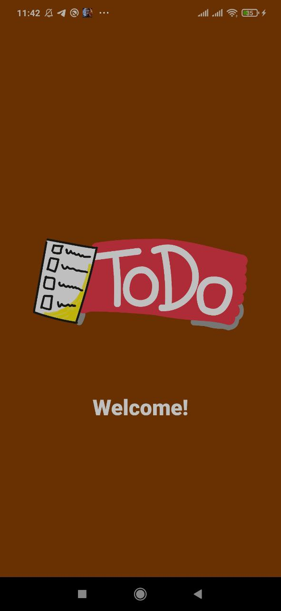
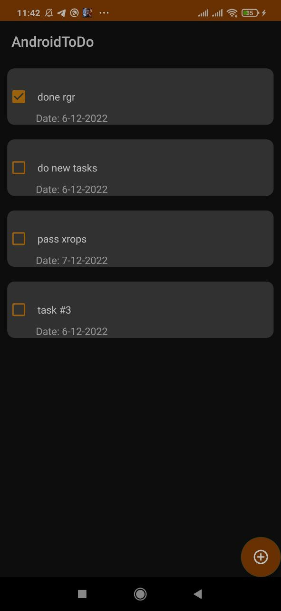
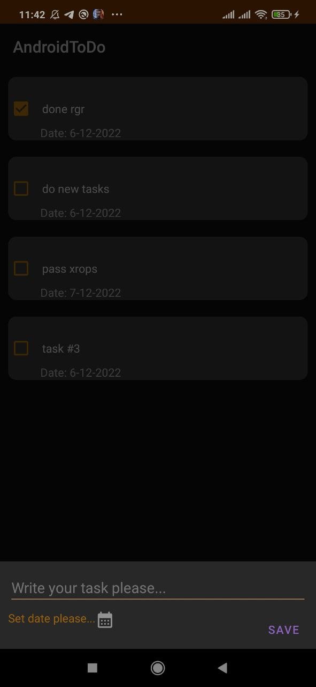
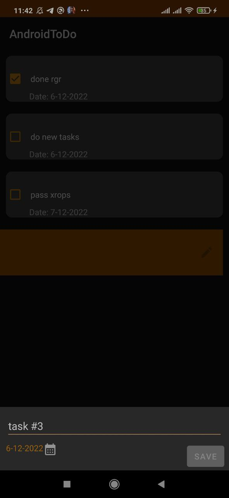
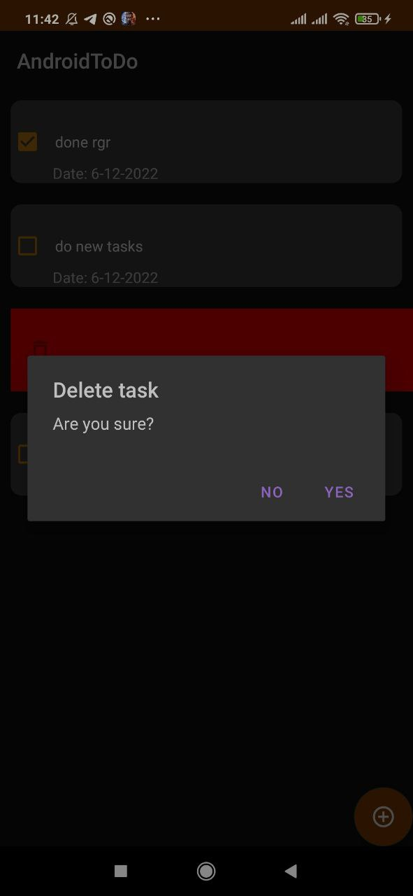

# To Do 

## Preview
1. This project uses jdk 8;
2. This project works with Firebase sdk.

## Features
☑️ You can create your tasks;
☑️ You can edit, delete your tasks;
☑️ You can marked your task as executed.

## Launch guide
To run this project you will need to install this project in phone with Android Operating System.

## Program testing
<i><b>Start work program. You can see for 2 seconds this activity.</b></i> 

 <i><b>Main Activity</b></i> 

 <i><b>Create Task</b></i> 

 <i><b>Edit Task</b></i> 

 <i><b>Delete Task</b></i> 

